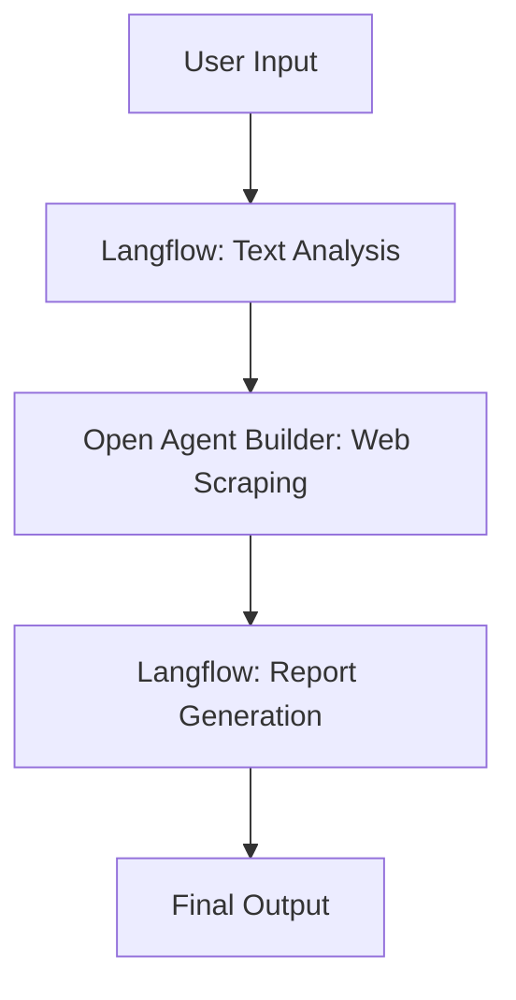

# Langflow Integration Guide

## Overview

[Langflow](https://www.langflow.org/) is an open-source visual framework for building multi-agent and RAG applications. This document provides guidance on integrating Langflow with the Open Agent Builder platform.

## What is Langflow?

Langflow is a powerful tool that allows users to:
- Build AI workflows visually using a drag-and-drop interface
- Create custom components and agents
- Integrate with various AI models and APIs
- Deploy workflows as APIs or chatbots
- Use pre-built components for common AI tasks

## Integration Options

### 1. MCP (Model Context Protocol) Integration

Langflow supports MCP, which allows it to connect with external tools and services. You can integrate Open Agent Builder with Langflow through MCP:

```yaml
# Example MCP server configuration
mcpServers:
  open-agent-builder:
    command: "npx"
    args: ["-y", "@modelcontextprotocol/server-open-agent-builder"]
    env:
      OPEN_AGENT_BUILDER_API_KEY: "your-api-key"
```

### 2. API Integration

Use Open Agent Builder's REST API to integrate with Langflow workflows:

```python
# Example Langflow component for Open Agent Builder
from langflow import CustomComponent

class OpenAgentBuilderComponent(CustomComponent):
    def build_config(self):
        return {
            "api_key": {"type": "str", "required": True},
            "workflow_id": {"type": "str", "required": True},
            "input_data": {"type": "str", "required": True},
        }

    def build(self, api_key: str, workflow_id: str, input_data: str):
        import requests

        response = requests.post(
            f"https://api.openagentbuilder.com/workflows/{workflow_id}/run",
            headers={"Authorization": f"Bearer {api_key}"},
            json={"input": input_data}
        )
        return response.json()
```

### 3. Direct Component Integration

Create custom Langflow components that leverage Open Agent Builder's capabilities:

```python
# Custom component for web scraping workflows
class WebScraperComponent(CustomComponent):
    def build(self, url: str, extraction_prompt: str):
        # Use Open Agent Builder's web scraping capabilities
        # Implementation details...
        pass
```

## Comparison: Open Agent Builder vs Langflow

| Feature | Open Agent Builder | Langflow |
|---------|-------------------|----------|
| **Primary Focus** | Agent and workflow building | Multi-agent and RAG applications |
| **Interface** | Visual programming | Visual programming |
| **Backend** | Next.js + Convex | Python/FastAPI |
| **Deployment** | Cloud-native | Self-hosted/Cloud |
| **Integration** | MCP, REST APIs | MCP, Python packages |
| **UI Framework** | React + Tailwind | React + custom UI |
| **Database** | Convex (real-time) | SQLite/PostgreSQL |
| **Authentication** | Clerk | Custom/OAuth |

## Use Cases

### When to Use Open Agent Builder
- Building agent-based workflows
- Real-time collaborative editing
- Web scraping and data extraction
- Complex multi-step processes
- Integration with modern web apps

### When to Use Langflow
- RAG applications
- Multi-agent systems
- Python-based AI workflows
- Academic/research projects
- Integration with Python ML ecosystem

### Combined Usage
- Use Langflow for AI/ML heavy lifting
- Use Open Agent Builder for web automation and data processing
- Connect them via MCP for seamless integration

## Setting Up Integration

### Prerequisites
1. Open Agent Builder API key
2. Langflow installation
3. MCP server setup (optional)

### Step-by-Step Setup

1. **Install Langflow:**
```bash
pip install langflow
```

2. **Create Open Agent Builder Component:**
```python
# Save as open_agent_builder_component.py
from langflow import CustomComponent
import requests

class OpenAgentBuilderComponent(CustomComponent):
    display_name = "Open Agent Builder"
    description = "Execute Open Agent Builder workflows"

    def build_config(self):
        return {
            "api_key": {
                "display_name": "API Key",
                "type": "str",
                "required": True,
                "password": True
            },
            "workflow_id": {
                "display_name": "Workflow ID",
                "type": "str",
                "required": True
            },
            "input_data": {
                "display_name": "Input Data",
                "type": "str",
                "required": True
            }
        }

    def build(self, api_key: str, workflow_id: str, input_data: str):
        try:
            response = requests.post(
                f"https://api.openagentbuilder.com/workflows/{workflow_id}/run",
                headers={
                    "Authorization": f"Bearer {api_key}",
                    "Content-Type": "application/json"
                },
                json={"input": input_data}
            )
            response.raise_for_status()
            return response.json()
        except requests.RequestException as e:
            return {"error": str(e)}
```

3. **Add Component to Langflow:**
- Place the component file in your Langflow components directory
- Restart Langflow
- The component will appear in the components panel

## Example Workflow

Here's an example of a combined workflow using both tools:

1. **Langflow**: Process and analyze text with AI models
2. **Open Agent Builder**: Extract data from websites based on analysis
3. **Langflow**: Generate reports from extracted data



## Best Practices

### Performance
- Use async execution for long-running workflows
- Implement proper error handling and retries
- Cache results when possible

### Security
- Store API keys securely
- Use HTTPS for all communications
- Implement rate limiting

### Monitoring
- Log workflow execution times
- Monitor API usage and costs
- Set up alerts for failures

## Troubleshooting

### Common Issues

1. **Connection Timeout**
   - Check network connectivity
   - Verify API endpoints are accessible
   - Increase timeout values

2. **Authentication Errors**
   - Verify API key is correct and active
   - Check token expiration
   - Ensure proper headers are set

3. **Component Not Loading**
   - Restart Langflow after adding components
   - Check Python path and imports
   - Verify component syntax

## Resources

- [Langflow Documentation](https://docs.langflow.org/)
- [Open Agent Builder API Docs](https://docs.openagentbuilder.com/)
- [MCP Specification](https://modelcontextprotocol.io/specification)
- [Langflow GitHub](https://github.com/langflow-ai/langflow)

## Contributing

When contributing integrations:
1. Test thoroughly with both platforms
2. Document all configuration options
3. Provide example workflows
4. Include error handling examples
5. Update this documentation</content>
</xai:function_call: create_file>  
<parameter name="path">/Users/jkneen/Documents/GitHub/flows/open-agent-builder/langflow.md
